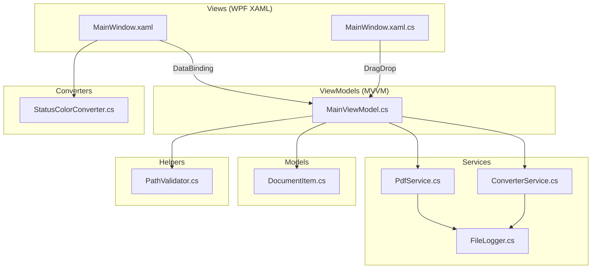

## Plan Karsilastirmasi

Uc farkli plan uretildi. Karsilastirma:

| Kriter | Plan 1 (Claude) | Plan 2 (GPT) | Plan 3 (Gemini) |
|---|---|---|---|
| **Split UI** | Mevcut grid'e satir ekleme | TabControl ile ayri sekme | Mevcut buton grubuna ekleme |
| **Logging** | `FileLogger.cs` static sinif | `LoggingService.cs` sinif | Inline catch bloklari |
| **Path Validation** | `Helpers/PathValidator.cs` | `Services/PathValidationService.cs` | Inline kontrol |
| **Hata Yonetimi** | Generic `catch(Exception)` + log | `OperationResult.cs` model | Typed exception (`IOException`) |
| **Ek Dosyalar** | `.editorconfig`, `.gitignore` | `.sln`, `TempFileService.cs` | Minimal |

**Onerilen Yaklasim:**
- **Split UI**: Plan 1'in yaklasimi (mevcut grid'e entegre) - basit ve spesifikasyona uygun
- **Logging**: Plan 1'in `FileLogger.cs` yaklasimi - yeterli ve sade
- **Path Validation**: Plan 1'in `PathValidator.cs` yaklasimi - guvenlik icin ayri sinif mantikli
- **Hata Yonetimi**: Plan 3'un typed exception yaklasimi ile Plan 1'in logging'ini birlestirelim
- **Ek Dosyalar**: `.gitignore` + `.sln` (IDE uyumu icin)

---

## Mimari Genel Bakis



---

## Adim 1: Proje Iskeletini Olusturma

### 1.1 Dizin Yapisi
Asagidaki dizinleri `D:\Proje\Proje Versiyonlari\Dosaya Donusturme\` altinda olustur:

```
DocMasterPro/
├── desktop-app/
│   ├── Assets/
│   ├── Converters/
│   ├── Helpers/          ← YENi
│   ├── Models/
│   ├── Services/
│   ├── ViewModels/
│   └── Views/
└── installer/
```

### 1.2 `.gitignore` Dosyasi
- Kok dizinde `.gitignore` olustur
- Icerigi: `bin/`, `obj/`, `.vs/`, `*.user`, `installer/Output/`, `*.suo`, `*.DotSettings`

### 1.3 `DocMasterPro.sln` (Solution Dosyasi)
- `dotnet new sln` ile olustur, `desktop-app/DocConverter.csproj`'yi ekle

---

## Adim 2: Proje Dosyasi (`.csproj`)

**Dosya:** `DocMasterPro/desktop-app/DocConverter.csproj`

Spesifikasyondaki icerik + su eklemeler:
- `<ApplicationIcon>Assets\app.ico</ApplicationIcon>` (exe ikonu icin)
- NuGet paketleri: PDFsharp 1.51.5185, Magick.NET-Q8-AnyCPU 13.7.0, CommunityToolkit.Mvvm 8.2.2

---

## Adim 3: Model Katmani

**Dosya:** `DocMasterPro/desktop-app/Models/DocumentItem.cs`

**Bug #2 Duzeltmesi - INotifyPropertyChanged eksik:**
- Sinifi `ObservableObject`'ten turet (CommunityToolkit.Mvvm)
- Tum property'leri `[ObservableProperty]` ile backing field olarak tanimla:
  - `private string fileName = string.Empty;`
  - `private string filePath = string.Empty;`
  - `private string extension = string.Empty;`
  - `private string status = "Ready";`
  - `private string? convertedPath;`
- Bu sayede `Status` degisiklikleri UI'da aninda yansiyacak

---

## Adim 4: Servis Katmani

### 4.1 `Services/FileLogger.cs` (YENi)

**Dosya:** `DocMasterPro/desktop-app/Services/FileLogger.cs`

- Static sinif, `%LOCALAPPDATA%\DocMasterPro\logs\app.log` dosyasina yazar
- Thread-safe (`lock` ile)
- Metodlar: `LogError(string context, Exception ex)`, `LogInfo(string message)`
- Log format: `[YYYY-MM-DD HH:mm:ss] [LEVEL] context: message`

### 4.2 `Services/PdfService.cs`

**Dosya:** `DocMasterPro/desktop-app/Services/PdfService.cs`

Spesifikasyondaki icerik + su duzeltmeler:

**Bug #7 Duzeltmesi - Bos catch bloklari:**
- `catch { }` yerine `catch (IOException ex) { FileLogger.LogError("MergePdf", ex); }`
- `UnauthorizedAccessException` icin de ayri catch blogu

**Guvenlik - Sayfa araligi dogrulama (SplitPdfAsync):**
- `From >= 1`, `To >= From`, `To <= source.PageCount` kontrolu
- Gecersiz aralik icin `ArgumentOutOfRangeException` firlat

### 4.3 `Services/ConverterService.cs`

**Dosya:** `DocMasterPro/desktop-app/Services/ConverterService.cs`

**Bug #6 Duzeltmesi - Kaynak dizine yazma:**
- Ciktiyi `Path.GetTempPath()` altina yaz:
  ```csharp
  string tempDir = Path.Combine(Path.GetTempPath(), "DocMasterPro");
  Directory.CreateDirectory(tempDir);
  string output = Path.Combine(tempDir, $"{Path.GetFileNameWithoutExtension(imagePath)}_{Guid.NewGuid():N}.pdf");
  ```
- Hata yonetimi: `try/catch` ile `FileLogger.LogError()` cagir

---

## Adim 5: Yardimci Katman

### 5.1 `Helpers/PathValidator.cs` (YENi)

**Dosya:** `DocMasterPro/desktop-app/Helpers/PathValidator.cs`

- Static sinif
- `IsPathSafe(string path)`: Path traversal (`..`) kontrolu, `Path.GetFullPath` ile normalizasyon
- `ValidatePageRanges(string input, int maxPage)`: "1-3, 5-7" formatini parse edip `List<(int, int)>` dondurur
- Gecersiz girdi icin anlamli hata mesajlari

---

## Adim 6: ViewModel Katmani

**Dosya:** `DocMasterPro/desktop-app/ViewModels/MainViewModel.cs`

Spesifikasyondaki icerik + su duzeltmeler/eklemeler:

**Bug #8 Duzeltmesi - CanExecute yenilenmesi:**
```csharp
partial void OnDocumentsChanged(ObservableCollection<DocumentItem> value)
{
    value.CollectionChanged += (_, _) => MergeCommand.NotifyCanExecuteChanged();
}

partial void OnIsBusyChanged(bool value)
{
    MergeCommand.NotifyCanExecuteChanged();
    SplitCommand.NotifyCanExecuteChanged();
}
```

**Bug #4 Duzeltmesi - PDF Split UI entegrasyonu:**
- `[ObservableProperty] private string pageRangeText = "";` (TextBox binding icin)
- `[RelayCommand] SplitCommand`:
  1. OpenFileDialog ile tek PDF sec
  2. `PathValidator.ValidatePageRanges()` ile araliklari parse et
  3. FolderBrowserDialog ile cikis klasoru sec
  4. `_pdf.SplitPdfAsync()` cagir
  5. Durum guncelle

**Guvenlik - Temp dosya temizligi:**
- Merge icerisinde `try/finally` blogu ile gecici dosyalarin her durumda silinmesini garanti et

**Guvenlik - Path dogrulama:**
- `AddFiles()` ve drag-drop'tan gelen yollari `PathValidator.IsPathSafe()` ile dogrula

---

## Adim 7: Converter Katmani

**Dosya:** `DocMasterPro/desktop-app/Converters/StatusColorConverter.cs`

- Spesifikasyondaki icerikle birebir ayni
- Degisiklik gerekmiyor

---

## Adim 8: View Katmani (UI)

### 8.1 `App.xaml`

**Dosya:** `DocMasterPro/desktop-app/App.xaml`

**Bug #1 Duzeltmesi - BooleanToVisibilityConverter:**
- `ResourceDictionary` icerisine ekle:
  ```xml
  <BooleanToVisibilityConverter x:Key="BoolToVis"/>
  ```

### 8.2 `App.xaml.cs`

- Spesifikasyondaki icerikle ayni

### 8.3 `Views/MainWindow.xaml`

**Dosya:** `DocMasterPro/desktop-app/Views/MainWindow.xaml`

**Bug #1 Duzeltmesi:**
- `Converter={StaticResource {x:Static BooleanToVisibilityConverter}}` yerine `Converter={StaticResource BoolToVis}`

**Bug #3 Duzeltmesi - ListView ItemTemplate/GridView catismasi:**
- `ItemTemplate` attribute'unu kaldir
- `GridView` yapisini koru
- Durum sutunu icin `GridViewColumn.CellTemplate` kullan (renkli Border + StatusColorConverter)

**Bug #4 - Split UI Elemanlari:**
- Mevcut Grid'e yeni bir Row ekle (butonlarin ustune)
- Icerik:
  ```xml
  <StackPanel Grid.Row="2" Orientation="Horizontal" Margin="0,4">
    <TextBlock Text="Sayfa Araligi:" VerticalAlignment="Center" Margin="0,0,8,0"/>
    <TextBox Text="{Binding PageRangeText}" Width="200" VerticalAlignment="Center"/>
    <Button Content="Bol" Command="{Binding SplitCommand}" Margin="8,0"/>
  </StackPanel>
  ```
- Grid RowDefinitions'a yeni `Auto` satir ekle
- Butonlar `Grid.Row="3"`, ProgressBar `Grid.Row="2"` olarak guncelle

**DragEnter handler eklenmesi:**
- `DragEnter="ListView_DragEnter"` attribute'u ekle (gorsel geri bildirim icin)

### 8.4 `Views/MainWindow.xaml.cs`

**Dosya:** `DocMasterPro/desktop-app/Views/MainWindow.xaml.cs`

- Spesifikasyondaki icerik + su eklemeler:
- `ListView_DragEnter` handler: `e.Effects = DragDropEffects.Copy`
- Path dogrulama: `PathValidator.IsPathSafe(f)` kontrolu drag-drop sirasinda

---

## Adim 9: Assets

**Dosya:** `DocMasterPro/desktop-app/Assets/app.ico`

- Gecerli bir `.ico` dosyasi olustur (256x256 boyutunda)
- PowerShell veya .NET kodu ile programatik olarak olusturulabilir
- `.csproj`'de `<ApplicationIcon>Assets\app.ico</ApplicationIcon>` olarak referansla

---

## Adim 10: Installer

**Dosya:** `DocMasterPro/installer/setup.iss`

- Spesifikasyondaki icerik kullanilacak
- **Not:** `[Run]` bolumundeki `{tmp}\dotnet-installer.exe` referansi eksik - runtime indirme mekanizmasi yok. Uretim icin Inno Download Plugin veya runtime bundle gerekir. Su anlik spesifikasyondaki haliyle birakip README'de belirtilecek.

---

## Adim 11: README

**Dosya:** `DocMasterPro/README.md`

- Proje ozeti, ozellikler tablosu
- On kosullar (.NET 8 SDK, Windows 10+, Inno Setup)
- Derleme ve calistirma komutlari
- Release derleme komutu
- Bilinen kisitlamalar (PDFsharp sifreli PDF, Magick.NET bellek, Inno Setup runtime)

---

## Adim 12: Derleme ve Dogrulama

1. `cd DocMasterPro/desktop-app`
2. `dotnet restore` - NuGet paketlerini indir
3. `dotnet build` - derleme (hata 0 olmali)
4. Derleme hatalari varsa duzelttikten sonra tekrar derle
5. `dotnet run` - uygulamayi calistir ve UI kontrolu

---

## Dosya -> Hedef Eslestirme

| Adim | Dosya(lar) | Dogrulama |
|---|---|---|
| 1 | Dizin yapisi, `.gitignore`, `.sln` | Dizinler mevcut, `dotnet sln list` |
| 2 | `DocConverter.csproj` | `dotnet restore` basarili |
| 3 | `Models/DocumentItem.cs` | Derleme basarili |
| 4 | `Services/FileLogger.cs`, `PdfService.cs`, `ConverterService.cs` | Derleme basarili |
| 5 | `Helpers/PathValidator.cs` | Derleme basarili |
| 6 | `ViewModels/MainViewModel.cs` | Derleme basarili |
| 7 | `Converters/StatusColorConverter.cs` | Derleme basarili |
| 8 | `App.xaml`, `App.xaml.cs`, `MainWindow.xaml`, `MainWindow.xaml.cs` | `dotnet build` exit code 0 |
| 9 | `Assets/app.ico` | Dosya mevcut, gecerli ico |
| 10 | `installer/setup.iss` | Dosya mevcut |
| 11 | `README.md` | Dosya mevcut |
| 12 | Tam proje | `dotnet build -c Release` basarili |

---

## Tamamlanma Kriterleri (DoD)

- [ ] Tum 14 dosya olusturuldu
- [ ] 8 bug duzeltildi (BoolToVis, INotifyPropertyChanged, ListView, Split UI, app.ico, temp dizin, catch bloklari, CanExecute)
- [ ] 3 guvenlik iyilestirmesi uygulandi (try/finally, path validation, page range validation)
- [ ] `dotnet build` hatasiz tamamlaniyor
- [ ] Uygulama baslatildiginda "DocMaster Pro" penceresi aciliyor
- [ ] Dosya ekleme (dialog + surukleme) calisiyor
- [ ] PDF birlestirme calisiyor
- [ ] Durum renkleri guncelleniyor
- [ ] Ilerleme cubugu gorunuyor
- [ ] PDF bolme UI'dan calistiriliyor
